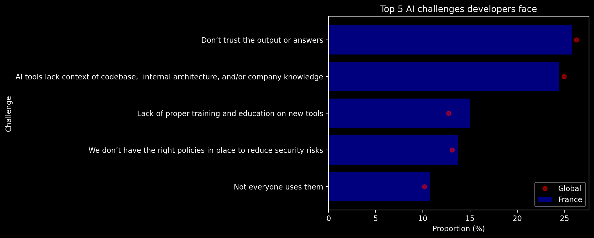
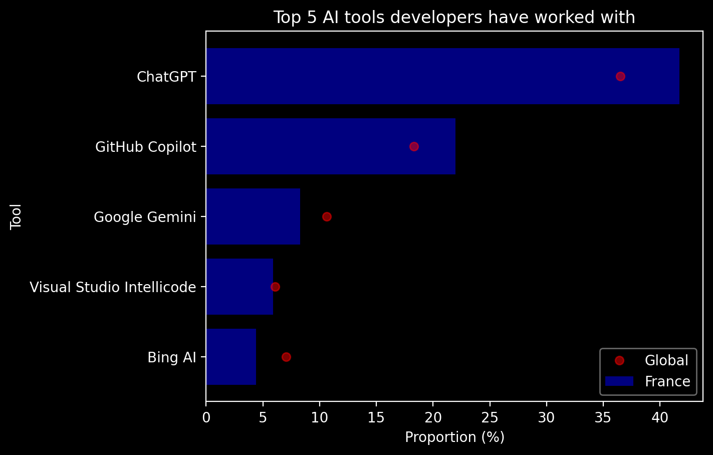
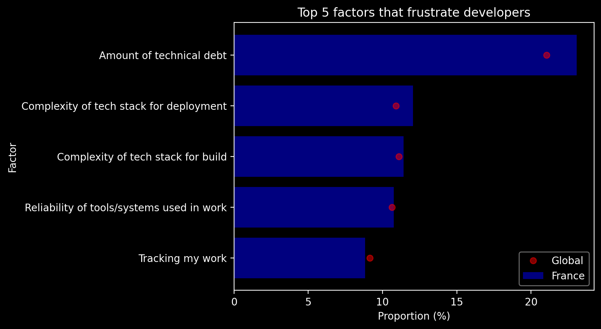
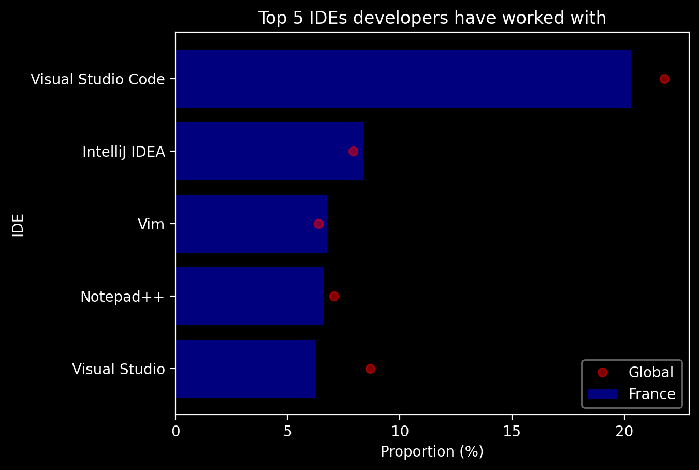
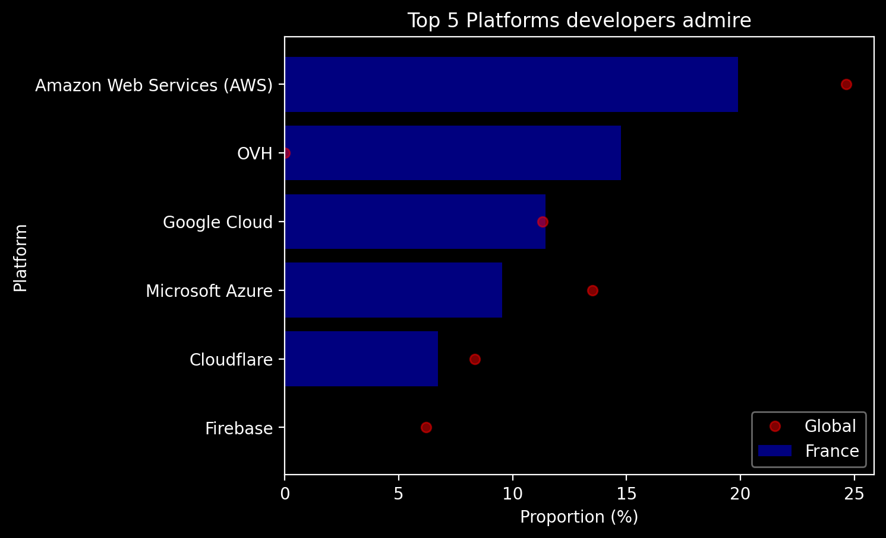
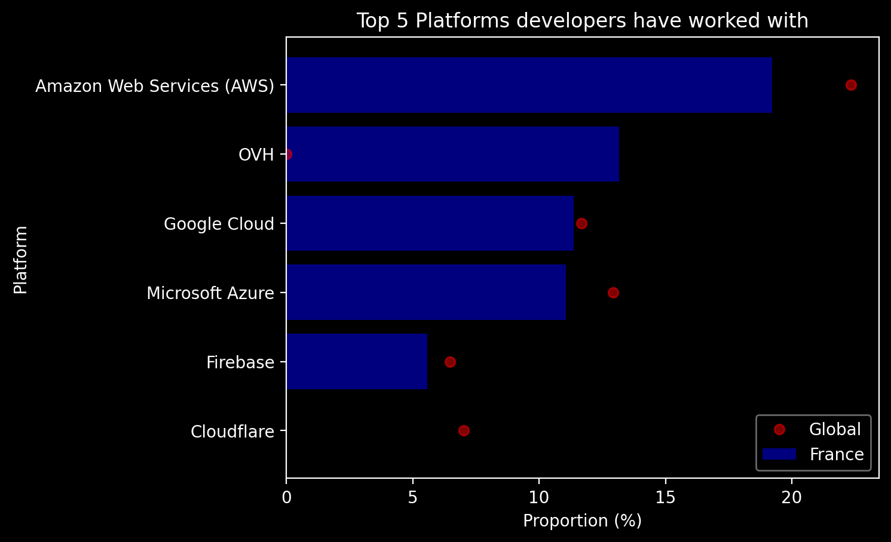
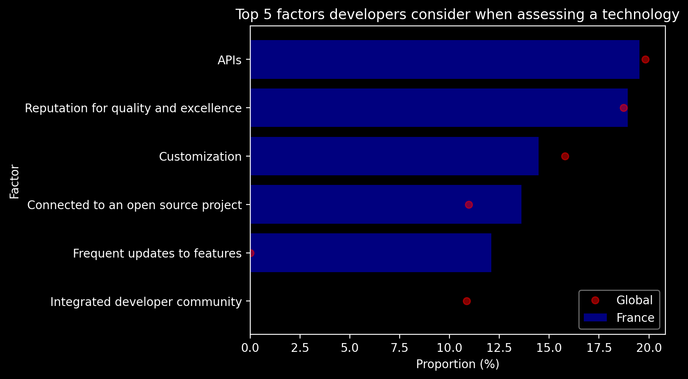

# StackOverflow Survey Charts

Data sources come from [Stack Overflow Annual Developer Survey](https://survey.stackoverflow.co). Results are filtered to France, but can be changed to any other country.

## Results

